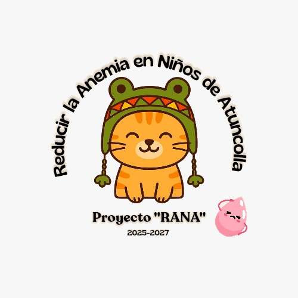

# 🐸 Proyecto Rana - Modernización Web

<div align="center">




<p align="center">
  <br />
  <a href="https://adiegomq.github.io/proyecto-rana/">
    
  </a>
</p>

</div>

---

### 📖 Descripción del Proyecto

Este repositorio contiene la **modernización completa** del sitio web oficial para la iniciativa **"Proyecto Rana"**, migrando el contenido y la estructura que previamente se encontraban alojados en la plataforma Blogspot.

El trabajo consistió en un rediseño integral y desarrollo frontend desde cero utilizando tecnologías web nativas y modernas. El objetivo principal fue transformar la experiencia de usuario, optimizar la accesibilidad, renovar la estética visual por completo y asegurar una compatibilidad absoluta con dispositivos móviles.

---

## 🎯 Objetivos de la Modernización

* 🚀 **Migración Tecnológica:** Reemplazar una plantilla rígida de Blogspot por una solución web estática, limpia y altamente eficiente.
* 🎨 **Interfaz de Vanguardia:** Diseñar una UI moderna con tipografía estilizada, espaciados equilibrados y componentes limpios.
* 🗺️ **Arquitectura de Información:** Optimizar los menús y la organización interna para facilitar el acceso al contenido.
* 📱 **Adaptabilidad Total:** Implementar un diseño *Responsive* optimizado para smartphones, tablets y pantallas de escritorio.
* 🛠️ **Mantenimiento Ágil:** Estructurar un código fuente legible, modular y fácil de actualizar a futuro.

---

## ✨ Mejoras e Innovaciones Implementadas

* **`Mobile-First`** Layouts totalmente flexibles que priorizan la visualización impecable en dispositivos móviles.
* **`Bootstrap 5 UI`** Integración de componentes dinámicos de última generación (modales, colapsables, tarjetas).
* **`Microinteracciones`** Animaciones fluidas que aportan dinamismo a la navegación sin sobrecargar la carga visual.
* **`Estructura Indexada`** Separación impecable de recursos multimedia, estilos globales e interacciones lógicas.
* **`Gráficos Vectoriales`** Uso de iconografía escalable que mantiene una nitidez perfecta en pantallas de alta densidad de píxeles.

---

## 🛠️ Tecnologías e Infraestructura

El stack tecnológico fue seleccionado meticulosamente para garantizar un sitio ligero, veloz y sin dependencias complejas de servidor:

<p align="left">
  
  
  
  
  
  
</p>

---

## 📂 Arquitectura del Repositorio

Estructura modular diseñada para un flujo de trabajo frontend ordenado:

```text
Proyecto-Rana/
├── assets/               # Bancos de imágenes, logos y recursos gráficos
├── css/                  # Estilos personalizados y archivos de extensión
├── js/                   # Controladores JavaScript y lógica de vistas
├── actividades.html      # Catálogo e información de actividades del proyecto
├── recursos.html         # Centro de descargas y enlaces institucionales
├── equipo.html           # Presentación del equipo de trabajo
├── preguntas.html        # Módulo de preguntas frecuentes (FAQ)
└── index.html            # Landing page / Punto de acceso principal
